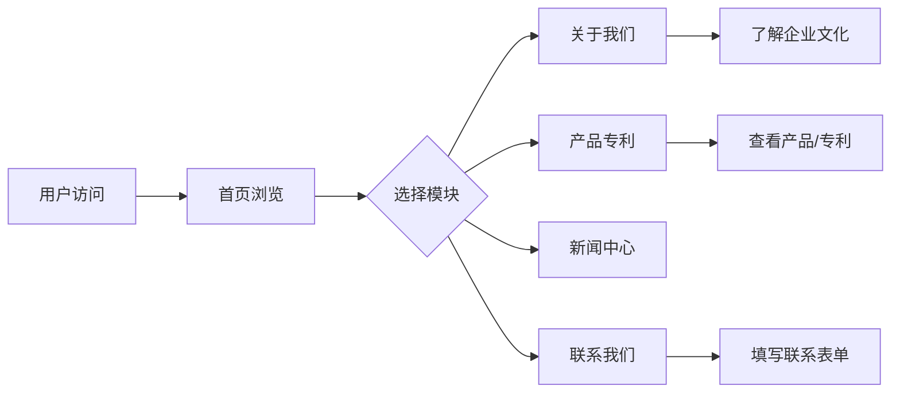

## 1. Product Overview
公司官网是展示企业文化、产品专利和企业形象的核心平台，旨在提升品牌知名度，吸引潜在客户和合作伙伴。
- 主要目的：展示企业文化理念、产品专利、企业实力
- 目标用户：潜在客户、合作伙伴、投资者、求职者

## 2. Core Features

### 2.1 User Roles
| Role | Registration Method | Core Permissions |
|------|---------------------|------------------|
| Visitor | No registration required | Browse all public content |

### 2.2 Feature Module
1. **首页**: 企业形象展示、导航、核心价值主张
2. **关于我们**: 企业文化、发展历程、企业愿景
3. **产品专利**: 产品展示、专利技术、核心优势
4. **新闻中心**: 企业动态、行业资讯
5. **联系我们**: 联系方式、留言表单

### 2.3 Page Details
| Page Name | Module Name | Feature description |
|-----------|-------------|---------------------|
| 首页 | Hero区域 | 全屏轮播展示企业形象，支持自动切换 |
| 首页 | 核心优势 | 展示企业核心竞争力，图标+文字说明 |
| 首页 | 产品亮点 | 展示主要产品和专利技术 |
| 关于我们 | 企业文化 | 企业使命、愿景、价值观展示 |
| 关于我们 | 发展历程 | 时间轴形式展示企业发展里程碑 |
| 产品专利 | 产品列表 | 卡片式展示产品信息 |
| 产品专利 | 专利展示 | 专利证书展示、技术说明 |
| 新闻中心 | 新闻列表 | 新闻卡片列表，支持分类筛选 |
| 联系我们 | 联系表单 | 在线留言表单，包含姓名、邮箱、留言内容 |

## 3. Core Process
用户访问首页 → 浏览导航 → 查看企业文化/产品专利 → 联系企业

## 4. User Interface Design

### 4.1 Design Style
- **主色调**: 深蓝色 (#1a365d) 传递专业、信任、稳重
- **辅助色**: 金色 (#d4af37) 传递品质、高端感
- **按钮风格**: 圆角矩形，hover状态有颜色变化和阴影效果
- **字体**: 中文使用思源黑体，英文使用Roboto
- **布局风格**: 简洁大气的卡片式布局，留白充足
- **图标风格**: 使用Lucide图标库，线条简洁

### 4.2 Page Design Overview
| Page Name | Module Name | UI Elements |
|-----------|-------------|-------------|
| 首页 | Hero区域 | 全屏背景图、渐变遮罩、大标题、CTA按钮 |
| 首页 | 导航栏 | 固定顶部、品牌Logo、导航链接、响应式菜单 |
| 首页 | 核心优势 | 图标卡片、标题、描述文字、hover动画 |
| 关于我们 | 企业文化 | 三栏布局、图标、标题、详细描述 |
| 关于我们 | 发展历程 | 垂直时间轴、年份标记、事件描述 |
| 产品专利 | 产品列表 | 卡片网格、产品图片、名称、简介 |
| 新闻中心 | 新闻列表 | 卡片列表、缩略图、标题、日期、摘要 |
| 联系我们 | 联系表单 | 输入框、文本域、提交按钮、联系方式信息 |

### 4.3 Responsiveness
- Desktop-first设计，支持响应式适配
- 移动端：单列布局、汉堡菜单
- 平板端：自适应两列布局

### 4.4 3D Scene Guidance (Not applicable)
- 本项目不涉及3D场景