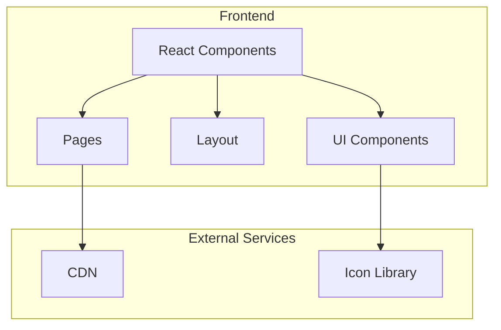

## 1. Architecture Design


## 2. Technology Description
- Frontend: React@18 + tailwindcss@3 + vite
- Initialization Tool: vite-init
- Backend: None (静态网站)
- Database: None (静态数据)

## 3. Route Definitions
| Route | Purpose |
|-------|---------|
| / | 首页 - 企业形象展示 |
| /about | 关于我们 - 企业文化、发展历程 |
| /products | 产品专利 - 产品和专利展示 |
| /news | 新闻中心 - 企业动态 |
| /contact | 联系我们 - 联系方式和留言表单 |

## 4. API Definitions (Not applicable)
- 本项目为静态网站，无需后端API

## 5. Server Architecture Diagram (Not applicable)
- 本项目为静态网站，无需后端服务

## 6. Data Model (Not applicable)
- 本项目使用静态mock数据，无需数据库

## 7. Project Structure
```
src/
├── components/
│   ├── Header.tsx          # 导航头部组件
│   ├── Footer.tsx          # 页脚组件
│   ├── Hero.tsx            # Hero区域组件
│   ├── FeatureCard.tsx     # 核心优势卡片
│   ├── ProductCard.tsx     # 产品卡片
│   ├── NewsCard.tsx        # 新闻卡片
│   ├── Timeline.tsx        # 时间轴组件
│   └── ContactForm.tsx     # 联系表单
├── pages/
│   ├── Home.tsx            # 首页
│   ├── About.tsx           # 关于我们
│   ├── Products.tsx        # 产品专利
│   ├── News.tsx            # 新闻中心
│   └── Contact.tsx         # 联系我们
├── data/
│   └── mockData.ts         # Mock数据
├── App.tsx                 # 主应用组件
├── main.tsx                # 入口文件
└── index.css               # 全局样式
```

## 8. Styling Guidelines
- 使用Tailwind CSS进行样式管理
- 主色调: #1a365d (深蓝色)
- 辅助色: #d4af37 (金色)
- 字体: 思源黑体 (中文), Roboto (英文)
- 响应式断点: sm(640px), md(768px), lg(1024px), xl(1280px)

## 9. Dependencies
- react@18
- react-router-dom@6
- tailwindcss@3
- lucide-react@latest
- vite@6